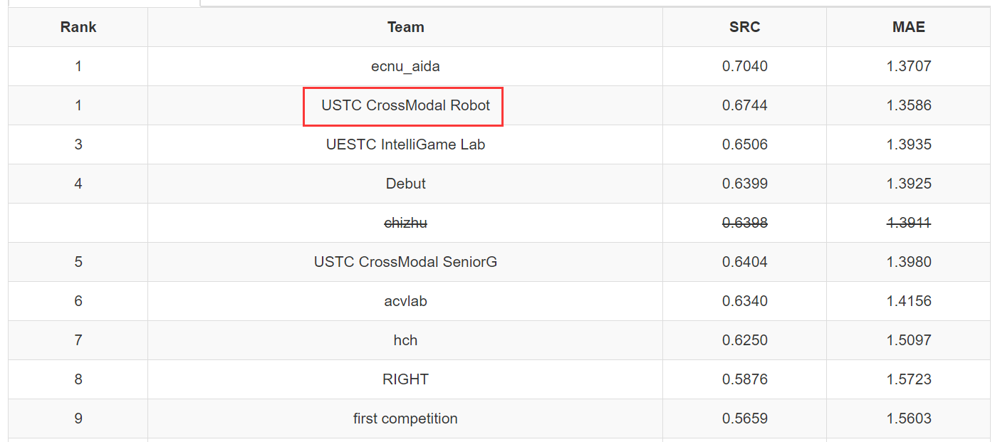

# Social Media Popularity Prediction Challenge 2020

## Introduction

The ``Social Media Popularity Prediction``task focuses on predicting the impact of sharing different posts for a publisher on social media. Given a photo (a.k.a. post) from a publisher, the goal is to automatically predict the popularity of the photo, e.g., view count for Flickr, Pin count for Pinterest, etc.

It is the implementation of the paper ``A Feature Generalization Framework for Social Media Popularity Prediction``

## Method Overview


## Requirments

Please use the following command to create the virtual environment in Ubuntu 16.04.

``` shell
conda env create -f environment.yml
```

## Usage

### Data Download

Download the original [SMP dataset](http://smp-challenge.com/download) to `data/data_source/` folder (or you can create a soft link for it).

### Feature Extraction and Processing

- visual feature extraction
- textual feature extraction
- numerical feature processing
- track additional user information
- sliding window average

Just follow the instruction in the features/readme.md

### Model Training

``` shell
cd methods/CatBoost
bash catboost.sh
```

### Popularity Prediction

``` shell
cd methods
python submission.py
```

### Reproduction

You can use our pre-extracted features and pre-trained model by this Baidu Netdisk [link](https://pan.baidu.com/s/1wRMKmb3OIol_Yd_ltYyAwg), and the verification code is `539j`

## Results

Our team method got the best performance in ACMMM 2020 SMP Challenge.



## Team Members

This work is done by [Kai Wang](https://github.com/wangkai997), [Penghui Wang](https://github.com/3288103265), [Xin Chen](https://github.com/chenxin-star), [Qiushi Huang](https://github.com/hqsiswiliam).

## Cite

Please cite these papers if you find this work useful in your research

```shell
@inproceedings{Wu2019SMP,
  title={SMP Challenge: An Overview of Social Media Prediction Challenge 2019},
  author={Wu, Bo and Cheng, Wen-Huang and Liu, Peiye and Liu, Bei and Zeng,   Zhaoyang and Luo,
  Jiebo},
  booktitle={Proceedings of the 27th ACM International Conference on Multimedia},
  year={2019}
}
@inproceedings{Wu2017DTCN,
  title={Sequential Prediction of Social Media Popularity with Deep Temporal  Context Networks},
  author={Wu, Bo and Cheng, Wen-Huang and Zhang, Yongdong and Qiushi, Huang and   Jintao, Li and
  Mei, Tao},
  booktitle={International Joint Conference on Artificial Intelligence (IJCAI)},
  year={2017},
  location = {Melbourne, Australia}
}
@inproceedings{Wu2016TemporalPrediction,
  author = {Wu, Bo and Mei, Tao and Cheng, Wen-Huang and Zhang, Yongdong},
  title = {Unfolding Temporal Dynamics: Predicting Social Media Popularity Using  Multi-scale Temporal
  Decomposition},
  booktitle = {Proceedings of the Thirtieth AAAI Conference on Artificial   Intelligence (AAAI)}
  year = {2016},
  location = {Phoenix, Arizona}
}
@inproceedings{2016TimeMatters,
  author = {Wu, Bo and Cheng, Wen-Huang and Zhang, Yongdong and Mei, Tao},
  title = {Time Matters: Multi-scale Temporalization of Social Media Popularity},
  booktitle = {Proceedings of the 2016 ACM on Multimedia Conference (ACM MM)},
  year = {2016},
  location = {Amsterdam, The Netherlands}
}

```

## Repository Directory

- data/ (shared link, codes)
- features/ (codes)
- methods/ (algorithm codes)
- results/ (results and visualization)

``` shell
SOCIAL_MEDIA_POPULARITY
├─data
│  ├─data_source
│  │  ├─test
│  │  └─train
│  └─preprocess_stage
├─features
│  ├─extracted_features
│  ├─feature_categories
│  │  ├─Bert_and_Xlnet
│  │  ├─DenseSIFT
│  │  ├─FastText
│  │  ├─Glove
│  │  ├─HoG
│  │  ├─Hu
│  │  ├─LightLDA
│  │  ├─LSA
│  │  ├─Number
│  │  ├─Onehot
│  │  ├─ResNeXt
│  │  ├─Sliding_window_average
│  │  ├─SURF
│  │  ├─TFIDF
│  │  └─Wordcount
│  ├─pretrained_model
│  ├─splited_label
│  └─visualization
├─figure
├─methods
│  ├─CatBoost
│  ├─MLP
│  ├─Seq2seq
│  ├─TCN
│  └─to_submit
└─results

```
