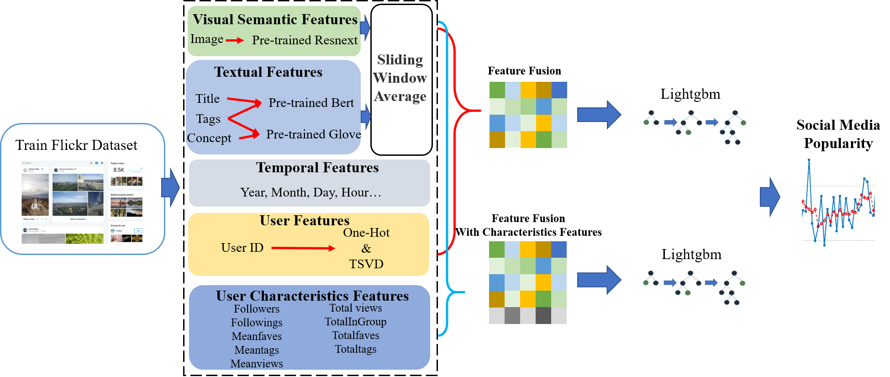
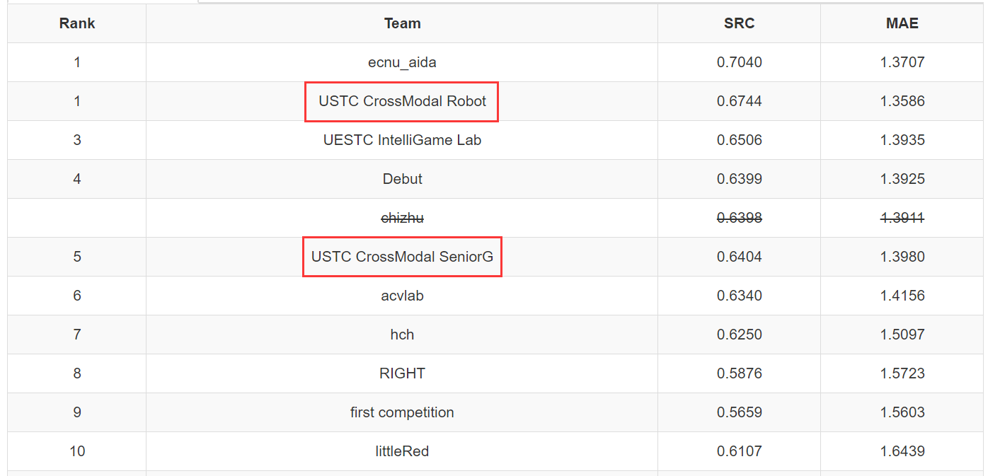

# Social Media Popularity Prediction Challenge 2020

## Introduction

The ``Social Media Popularity Prediction``task focuses on predicting the impact of sharing different posts for a publisher on social media. Given a photo (a.k.a. post) from a publisher, the goal is to automatically predict the popularity of the photo, e.g., view count for Flickr, Pin count for Pinterest, etc.

You can find meaningful information on the official website <http://smp-challenge.com/>

It is the implementation of ``USTC CrossModal Robot`` and ``USTC CrossModal SeniorG`` teams. You can get more detailed methods from the  the corresponding subdirectory.

## Method

The frameworks of our two teams are as follows:

### 


<p align="center">Method of USTC CrossModal Robot Team</p>

### 



<p align="center">Method of USTC CrossModal SeniorG Team</p>
<!-- <center>Method of USTC CrossModal SeniorG Team</center> -->

## Result

Both of our teams have achieved gratifying results



## Cite

Please cite these papers if you find this work useful in your research

```shell
@inproceedings{Wu2019SMP,
  title={SMP Challenge: An Overview of Social Media Prediction Challenge 2019},
  author={Wu, Bo and Cheng, Wen-Huang and Liu, Peiye and Liu, Bei and Zeng,   Zhaoyang and Luo,
  Jiebo},
  booktitle={Proceedings of the 27th ACM International Conference on Multimedia},
  year={2019}
}
@inproceedings{Wu2017DTCN,
  title={Sequential Prediction of Social Media Popularity with Deep Temporal  Context Networks},
  author={Wu, Bo and Cheng, Wen-Huang and Zhang, Yongdong and Qiushi, Huang and   Jintao, Li and
  Mei, Tao},
  booktitle={International Joint Conference on Artificial Intelligence (IJCAI)},
  year={2017},
  location = {Melbourne, Australia}
}
@inproceedings{Wu2016TemporalPrediction,
  author = {Wu, Bo and Mei, Tao and Cheng, Wen-Huang and Zhang, Yongdong},
  title = {Unfolding Temporal Dynamics: Predicting Social Media Popularity Using  Multi-scale Temporal
  Decomposition},
  booktitle = {Proceedings of the Thirtieth AAAI Conference on Artificial   Intelligence (AAAI)}
  year = {2016},
  location = {Phoenix, Arizona}
}
@inproceedings{2016TimeMatters,
  author = {Wu, Bo and Cheng, Wen-Huang and Zhang, Yongdong and Mei, Tao},
  title = {Time Matters: Multi-scale Temporalization of Social Media Popularity},
  booktitle = {Proceedings of the 2016 ACM on Multimedia Conference (ACM MM)},
  year = {2016},
  location = {Amsterdam, The Netherlands}
}

```


<!-- # Social Media Popularity Prediction Challenge
### Introduction
### problem overview
### Installation
### Usage
#### Data Download
#### Feature Extraction
#### How to run
#### Model Training
#### Results
#### People
#### Citation
#### Repository Directory

## Repository Directory

- data
    - Data Source
        - train
        - test
        - Data_link.md
    - Preprocessing Stage
- features
    - Feature Categories
    - Visualization
- methods
    - Algorithm List
    - environment_smp.yml
- models
- exp
    - code
- results
    - csv_file
    - figure

# Usage
To reproduce the result, just follow the following instructions.

## Extract Features
```
cd features
# run the sh file in each subfolder
```

After extract all the features, the sliding average is carried out using the code in "\data\Preprocessing Stage\feature_moving_average.py" for the extracted features, and the sliding step size adopted in the experiment is 5.

## Train lightgbm / catboost

```
# after obtain required features file

# train the catboost and predict the catboost result
cd exp\Experiment Tables
conda env create -f environment_cat.yml
conda activate environment_cat
unzip cat_knn_fill.zip
python cat_v100_knn_fill.py

# train the lightgbm and predict the lightgbm result
cd exp\Experiment Tables
conda env create -f environment_lgbm.yml
conda activate environment_lgbm
python LightGBM.py


# produce final result
python to_json.py
```


## Simply reproduction
Or you can simply reproduce the result without training. And the result will be save as "results/submit_results.csv"

All the trained model and csv feature file can be obtained at htzhangdrive@aaedu.edu.pl.

```
cd exp\Experiment Tables
python to_json.py
```
 -->
