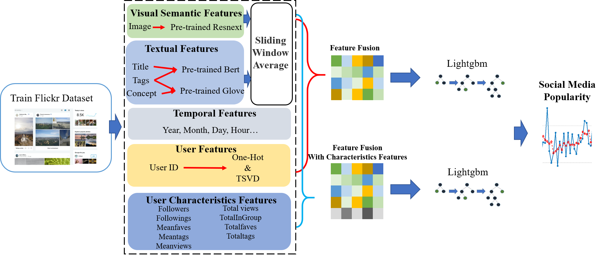

# Social Media Popularity Prediction Challenge 2020
## Introduction
Different from traditional media, modern social media platforms, such as Flickr, Facebook, Twitter and YouTube, rely more on user relationship networks for information exchange and dissemination. Social Media Prediction (SMP)is designed to make full use of user information, published posts and so on to predict its popularity after publication on social media. This task has high research and commercial value, which can benefit the content creation of “We Media” workers, recommendation system. In the SMP2020, 305613 images and related description information on Flickr are provided as datasets to find an accurate and stable popularity prediction model.

Our team establish a complete social media information intergration and full exploitation network, including user information, post content information and temporal information, and boosting model LightGBM is used to predict image popularity after extracting those features.

## Overview of the proposed methods



## Requirements
python 3.7

In addition, please install the required packages by the following command:

```python
pip install -r requirements.txt
```


## Usage
### Feature Extracting
Just follow the instruction in the features/Features.md

### Training Regression model
Just follow the instruction in the methods/Methods.md

### Reproduction

```python
conda env create -f environment.yml
conda activate env
cd exp/code
python Lightgbm.py 
python to_json.py
```

## Results
Our method eventually surpassed last year's best results and has been among the best this year despite a surge in participating teams.


## Team Members
This work is done by Mengqi Huang, Huatian Zhang, Jingjing Zhang and Ting Wang.


## Citation
If you find this work useful in your research, please consider citing:

```python
@inproceedings{Wu2019SMP,
  title={SMP Challenge: An Overview of Social Media Prediction Challenge 2019},
  author={Wu, Bo and Cheng, Wen-Huang and Liu, Peiye and Liu, Bei and Zeng,   Zhaoyang and Luo,
  Jiebo},
  booktitle={Proceedings of the 27th ACM International Conference on Multimedia},
  year={2019}
}

@inproceedings{Wu2017DTCN,
  title={Sequential Prediction of Social Media Popularity with Deep Temporal  Context Networks},
  author={Wu, Bo and Cheng, Wen-Huang and Zhang, Yongdong and Qiushi, Huang and   Jintao, Li and
  Mei, Tao},
  booktitle={International Joint Conference on Artificial Intelligence (IJCAI)},
  year={2017},
  location = {Melbourne, Australia}
}

@inproceedings{Wu2016TemporalPrediction,
  author = {Wu, Bo and Mei, Tao and Cheng, Wen-Huang and Zhang, Yongdong},
  title = {Unfolding Temporal Dynamics: Predicting Social Media Popularity Using  Multi-scale Temporal
  Decomposition},
  booktitle = {Proceedings of the Thirtieth AAAI Conference on Artificial   Intelligence (AAAI)}
  year = {2016},
  location = {Phoenix, Arizona}
}
```
